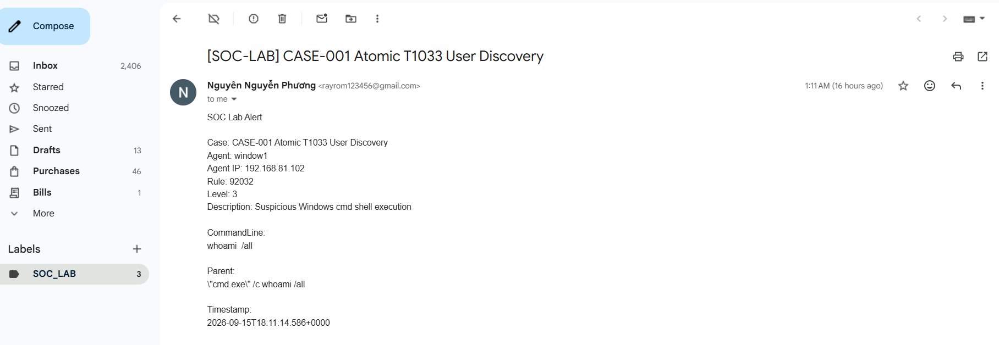

# SOC Automation Lab: Wazuh, Sysmon, Atomic Red Team, Shuffle SOAR, and Gmail

## Overview

This project is a small SOC automation lab built to simulate, detect, triage, and notify on Windows endpoint security events.

The lab uses Atomic Red Team to generate MITRE ATT&CK-based activity on a Windows endpoint, Sysmon and Wazuh Agent to collect telemetry, Wazuh Manager to detect suspicious behavior, Shuffle SOAR to filter and process alerts, and Gmail API to send incident notifications.


## Lab Architecture

The workflow below shows the full alert pipeline from the Windows endpoint to Wazuh, Shuffle SOAR, and Gmail.


```text
Windows 10 Endpoint VM
  - Wazuh Agent
  - Sysmon
  - Atomic Red Team
  - Invoke-AtomicRedTeam
        |
        | Endpoint telemetry
        v
Ubuntu Server VM
  - Wazuh Manager
  - Wazuh Indexer
  - Wazuh Dashboard
        |
        | Wazuh integration webhook
        v
Shuffle SOAR
  - Webhook trigger (receives Wazuh JSON alerts)
  - Python alert filter (forwards only high-value alerts)
  - Gmail API action (sends rapid notifications to the SOC team)
        |
        | Incident notification
        v
Gmail
  - SOC_LAB label/filter
```

## Network Layout

```text
Ubuntu Wazuh Server: 192.168.81.101
Windows Target VM:   192.168.81.102
```

## Components

| Component | Purpose |
|---|---|
| Wazuh Manager | Central SIEM/XDR manager for receiving endpoint telemetry and generating alerts |
| Wazuh Dashboard | Web interface for threat hunting and alert review |
| Wazuh Agent | Installed on the Windows endpoint to forward Windows/Sysmon events |
| Sysmon | Provides detailed Windows process, file, and network telemetry |
| Atomic Red Team | Generates controlled MITRE ATT&CK technique simulations |
| Shuffle SOAR | Receives Wazuh alerts, filters relevant cases, and triggers response actions |
| Gmail API | Sends SOC lab incident notifications |

## Implemented Detection Case

### CASE-001: Atomic T1033 User Discovery

**Goal:** Simulate account/user discovery on a Windows endpoint.

**Atomic Red Team technique:**

```text
T1033 - System Owner/User Discovery
```

**Command executed by Atomic Red Team:**

```text
whoami /all
```

**Observed Wazuh alert:**

```text
Rule ID: 92032
Rule level: 3
Description: Suspicious Windows cmd shell execution
MITRE mapping:
  - T1087 Account Discovery
  - T1059.003 Windows Command Shell
```

**Example evidence:**

```text
Agent: window1
Agent IP: 192.168.81.102
CommandLine: whoami /all
ParentCommandLine: "cmd.exe" /c whoami /all
```

## Planned Detection Cases

### CASE-002: System and Process Discovery

**Goal:** Simulate host and process enumeration after initial command execution.

**Atomic Red Team techniques:**

```text
T1082 - System Information Discovery
T1057 - Process Discovery
T1016 - System Network Configuration Discovery
```

**Expected commands:**

```text
systeminfo
tasklist
ipconfig /all
```

**Expected outcome:**

Wazuh should detect suspicious discovery activity from the Windows endpoint. Shuffle should classify the alert as a discovery case and send a labeled Gmail notification.

### CASE-003: Scheduled Task Persistence

**Goal:** Simulate basic persistence through Windows scheduled tasks.

**Atomic Red Team technique:**

```text
T1053.005 - Scheduled Task/Job: Scheduled Task
```

**Expected command pattern:**

```text
schtasks
```

**Expected outcome:**

Wazuh should detect scheduled task creation or suspicious command execution. Shuffle should classify the alert as a persistence case and send a Gmail notification.

## Shuffle SOAR Workflow

The Shuffle workflow currently follows this structure:

```text
Wazuh webhook
  -> evaluate_rule_level
  -> send_alert_email
```

### Wazuh Integration

Wazuh sends alerts to Shuffle using an integration block in:

```text
/var/ossec/etc/ossec.conf
```

Example structure:

```xml
<integration>
  <name>shuffle</name>
  <hook_url>SHUFFLE_WEBHOOK_URL</hook_url>
  <level>3</level>
  <alert_format>json</alert_format>
</integration>
```

### Alert Filtering Logic

The Python step filters Wazuh alerts so Gmail is not flooded by noisy events. If needed, the SOC team can still review the full telemetry in Wazuh Manager.

The current logic sends email only when the alert matches one of the selected lab cases. This approach can be scaled to meet broader enterprise detection and notification needs:

```text
CASE-001: command line contains whoami
CASE-002: command line contains systeminfo, tasklist, or ipconfig
CASE-003: command line contains schtasks, New-ScheduledTask, or Register-ScheduledTask
```

## Gmail Notification

Gmail notifications use a subject prefix:

```text
[SOC-LAB]
```

A Gmail filter applies the label:

```text
SOC_LAB
```

This keeps lab notifications organized and prevents the inbox from being flooded.

Example Gmail notification:



Example email subject:

```text
[SOC-LAB] CASE-001 Atomic T1033 User Discovery
```

Example email body:

```text
SOC Lab Alert

Case: CASE-001 Atomic T1033 User Discovery
Agent: window1
Agent IP: 192.168.81.102
Rule: 92032
Level: 3
Description: Suspicious Windows cmd shell execution

CommandLine:
whoami /all

Parent:
"cmd.exe" /c whoami /all

Timestamp:
2026-09-15T18:11:14.586+0000
```
## Atomic Red Team Commands

Set the Atomic Red Team path:

```powershell
$Atomics = "C:\AtomicRedTeam\atomics"
```

Run CASE-001:

```powershell
Invoke-AtomicTest T1033 -TestNumbers 8 -PathToAtomicsFolder $Atomics
```

Run CASE-002:

```powershell
Invoke-AtomicTest T1082 -TestNumbers 1 -PathToAtomicsFolder $Atomics
Invoke-AtomicTest T1057 -TestNumbers 2 -PathToAtomicsFolder $Atomics
Invoke-AtomicTest T1016 -TestNumbers 1 -PathToAtomicsFolder $Atomics
```

Preview CASE-003 before running:

```powershell
Invoke-AtomicTest T1053.005 -ShowDetailsBrief -PathToAtomicsFolder $Atomics
```

Run and clean up CASE-003:

```powershell
Invoke-AtomicTest T1053.005 -TestNumbers 1 -PathToAtomicsFolder $Atomics
Invoke-AtomicTest T1053.005 -TestNumbers 1 -Cleanup -PathToAtomicsFolder $Atomics
```
